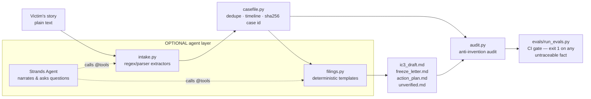

# Recourse — Architecture

The design centers on a single boundary: **deterministic Python owns extraction and structured
fields; optional model-written narrative is gated by an audit.** A filing draft with an invented
hash can be worse than no draft. Source quotes, deterministic templates, and runtime checks
reduce that risk; they do not establish complete factual correctness or replace human review.

## Data flow

1. **Intake (`intake.py`).** Pure regex/parsing — no model anywhere. EVM tx hashes
   (`0x` + 64 hex) and addresses (`0x` + 40 hex) use lookaround boundaries so truncated or
   overlong hex runs can never partially match. Bare 64-hex BTC txids and base58 addresses are
   *context-gated*: they are only accepted with transaction/wallet vocabulary nearby, because a
   false positive there poisons a federal filing while a miss just lands in `unverified.md`.
   Amounts normalize to `Decimal`; dates to ISO (ambiguous slash dates read as US month/day and
   flagged). An amount denominated in one thing but *paid* in another ("$12,500 worth of
   ETH") keeps both labels — `currency: USD`, `asset: ETH` — because a crypto leg reported
   to an exchange as "USD" is a false statement; no conversion is ever performed. Candidate
   subject business names (a capitalized run ending in a corporate suffix) are extracted for
   the IC3 Step 4 field but always rendered as candidates to confirm, never asserted — the
   story may just as easily name the victim's own bank. Every extracted fact carries its exact `verbatim` source substring — the
   provenance anchor everything downstream is audited against. Facts that co-occur in a
   paragraph are grouped into `Transaction`s; lone facts are never promoted into one.

2. **CaseFile (`casefile.py`).** Dedupe by `(kind, value)`, timeline-order transactions
   (dated first, narrative order for the rest), split verified facts from an explicit
   `unverified_notes` list. `case_id` = sha256 over canonical JSON of the normalized contents —
   stable across machines and runs. **No wall-clock reads anywhere in the library**:
   `created_at` is an optional explicit parameter and is excluded from the hash.

3. **Filings (`filings.py`).** Deterministic string templates over the CaseFile. The IC3 draft
   mirrors the real form's seven steps and its mechanics (10-transaction cap with overflow into
   the Step 5 description, 3,500-char description limit, amounts without `$`/commas, no
   uploads). The freeze letter never promises a freeze. Unknown fields render as
   `[NOT PROVIDED]` — never guessed. Every document is labeled DRAFT / not legal advice.

4. **Audit (`audit.py`) + eval gate (`evals/run_evals.py`).** The audit harvests every
   hash-like token, address, amount, and ISO date from each rendered document and verifies it
   traces to the source story (allowing two declared derivations: the summed loss total and the
   sha256 case id). The gate runs that audit over eight golden scenarios (including the exact story used in the demo video), checks extraction
   against hand-verified expected values exactly (both precision and recall), asserts
   negative-control lookalikes are *not* extracted, checks case-id determinism, and self-tests
   by tampering filings with invented facts that *must* be flagged. Non-zero exit on any
   failure; CI runs it on every push, offline, with no strands installed.

5. **Agent layer (`tools.py`, `agent.py`) — optional.** The same deterministic functions are
   exposed as Strands `@tool`s (imported lazily so the base install has no strands dependency).
   `build_agent()` uses the Anthropic provider when `ANTHROPIC_API_KEY` is set, else Strands'
   Amazon Bedrock default. The drafting tools take a `case_id` and nothing else — there is no story parameter for a
   model to paraphrase, so two drafts cannot disagree about which story they came from. Facts
   the agent learns mid-interview enter through `add_detail`, which appends the victim's words
   to the story and rebuilds, so they carry the same provenance as everything else; identity
   enters only through `set_complainant`. The one place the model authors filing content — the
   IC3 Step 5 narrative, via `propose_description` — is gated by the same audit the eval runs:
   any untraceable hash, address, amount, or date rejects the text with the violations listed. The system prompt forbids the model from stating any
   hash/amount/date not present in tool output and forbids filling in `[NOT PROVIDED]` fields.
   Structured fields are rendered by code. The optional description is model-authored prose,
   so its audit is a separate boundary with explicit limits: it cannot catch every assertion,
   number written out in words, or association between two otherwise source-backed facts.

6. **Local workbench (`workbench.py`, `web/`).** A stdlib HTTP server binds only to
   `127.0.0.1`. The packaged HTML/CSS/JavaScript interface submits a story, then displays the
   existing CaseFile and templates as literal text. Every build runs `verify_no_invention`;
   a failed audit stays inspectable and blocks export. ZIP requests rebuild from the story
   and rerun the audit, rather than accepting client-provided case fields or rendered files.
   ZIP entries have fixed timestamps, names, order, and permissions, with the CLI's exact
   UTF-8 file contents. No story is written to the server's filesystem or a case registry.

   Only `/`, `/assets/workbench.css`, `/assets/workbench.js`, and `/api/example` accept
   GET/HEAD. Only `/api/case` and `/api/bundle` accept POST. Requests containing query
   strings, alternative asset paths, or caller-supplied case data are rejected. Write requests
   require an exact local Host/Origin pair and a custom same-origin header; no CORS allowance
   is returned. Bodies are limited to 64 KiB, stories to 16,000 characters, and sockets have
   a ten-second timeout. Content-Length must be singular; transfer/content encodings are
   rejected. Responses disable caching and framing and apply a restrictive CSP. Default
   request logging and source-bearing tracebacks are suppressed.

   The UI renders story-derived content with `textContent`/`value`, never HTML or Markdown
   interpretation. Edits mark the previous result stale and disable file downloads until a
   rebuild. Source quotes can be selected in the input, and missing fields and the audit's
   limits remain visible. The interface does not collect complainant identity or run the
   optional interview. Browser/OS memory, extensions, and downloaded files are outside its
   storage boundary; this is a local utility, not a production hosting service.

## Why this shape wins for a fraud victim

Speed and trustworthiness are the two things a first response needs. The offline pipeline gives
speed with zero setup (no key, no network); the deterministic boundary plus the eval gate give a
draft the victim — and an investigator — can trust to contain only what the victim actually said,
with everything unknown labeled instead of hallucinated.
