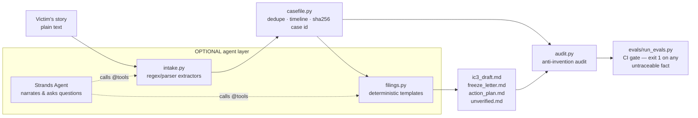

# Recourse

**A local evidence workbench for fraud response, with an optional interview agent.**
Paste your story — plain language plus whatever fragments you have (transaction hashes,
wallet addresses, amounts, dates, URLs, emails) — and
Recourse turns it into a reviewable evidence record and ready-to-review filing drafts, in minutes,
while acting fast still matters.

Built for the AWS **"Agents for Humans"** hackathon, **Good Neighbor track**, with the
[Strands Agents SDK](https://strandsagents.com). Born out of the maintainer's four years of
volunteer work with cybercrime victims: the hours right after a scam are when a freeze request or
a complete IC3 complaint can still change the outcome — and they are exactly the hours when a
panicked victim can't produce one.

> **Every document Recourse produces is a DRAFT for the victim to review before filing.
> Recourse is not a lawyer and nothing it outputs is legal advice.**

## What it does

From one pasted story, Recourse produces:

1. **`casefile.json`** — a canonical CaseFile: deduped, timeline-ordered evidence with exact
   source quotes, explicit missing fields, and a stable case id (sha256 of normalized contents).
2. **`ic3_draft.md`** — an FBI IC3 complaint draft mapped to the real form's seven steps
   (complaint type, victim info, financial transactions, subjects, description, other info,
   signature), respecting the form's actual mechanics (10-transaction cap, 3,500-character
   description limit, amounts with no `$` or commas, no file uploads).
3. **`freeze_letter.md`** — an exchange fraud-report / freeze-request letter with exact
   transaction details, conservatively worded (a freeze is requested, never promised).
4. **`action_plan.md`** — an ordered plan with urgency rationale and official links:
   exchange fraud team first (funds move fast), then IC3, FTC, local police, plus situational
   channels (SEC, CFTC, elder-fraud hotline) and a recovery-scam warning.
5. **`unverified.md`** — an explicit list of everything that could **not** be verified or was
   not provided. Nothing is ever guessed.

## Quickstart — offline mode (no API key, no external network, no model)

```bash
git clone https://github.com/bakulbadwal/recourse && cd recourse
python3 -m venv .venv && source .venv/bin/activate
pip install -e .

# Run the bundled fictional example:
python -m recourse demo --out demo-case/

# Run on your own story:
python -m recourse intake my_story.txt --out my-case/
```

The CLI produces five files, deterministic and reproducible —
same story in, same case id and same drafts out, on any machine, any day.

## The local browser workbench

Run `python -m recourse serve`, then open [127.0.0.1:8765](http://127.0.0.1:8765).
Use `--port 9876` to choose another port, or `--port 0` for a free one. The terminal prints
the address. Stop with **Ctrl+C**. The workbench adds no dependencies to the base install.

1. **Paste your story or load the fictional example.** Keep each transfer in its own paragraph.
   Use **Cmd/Ctrl + Enter** to build. Input is limited to 16,000 characters and a 64 KiB request.
2. **Inspect evidence.** Search extracted values and compare them with their exact source quotes.
   “Locate quote in story” selects the original words. Open the transfer timeline to review
   the extractor's groupings; nearby facts are not proof that they belong together.
3. **Review gaps and drafts.** The same engine's missing-information notes remain visible.
   Preview the IC3 complaint, freeze request, action plan, unverified report, and CaseFile JSON.
   Drafts are displayed as literal text; source URLs are not opened automatically.
4. **Download your record.** The ZIP contains exactly the five files listed above, with the same
   contents as the offline CLI. Individual files can also be downloaded. Changing the story
   disables downloads until you rebuild; a failed source audit also blocks export.

The UI supports keyboard navigation (arrow keys and Home/End in the review tabs), visible
focus, announced status/error messages, and narrow screens. A responsive layout does not expose
the server to other devices: it always binds to `127.0.0.1`.

**Local processing, draft-only output.** Stories travel from the page to the Python process
on your own computer. The workbench does not write stories to disk, keep a case database, log
request bodies or URLs, call a model, or contact institutions. All assets are bundled; there are
no remote scripts, fonts, or analytics. Clear the page to start again, and download any record
you want to keep. Downloaded files contain the story and must be handled as your own records.

**Source checks are not independent verification.** Each build and ZIP request runs
`build_casefile` → `render_all` → `verify_no_invention`. The audit covers its supported
numeric, date, and identifier patterns; it cannot establish what happened, validate a
counterparty, catch every unsupported statement, or detect every incorrect association.
Complainant identity remains blank in this interface; complete it in the downloaded drafts.

This server is intended for a local session, not public hosting. It serves only an explicit
list of packaged assets and API routes, enforces request limits and timeouts, checks Host
and same-origin write requests, and applies a restrictive Content Security Policy. It does
not serve the repository or expose a `--host` option.


*Actual local browser capture, September 5, 2026. The interface is an additional local workflow;
the CLI and optional Strands interview remain available.*

## Quickstart — agent mode (optional, interactive)

```bash
pip install -e ".[agent]"        # pulls in strands-agents[anthropic]

# Anthropic API — or set nothing and use AWS credentials for Amazon Bedrock (the Strands default):
export ANTHROPIC_API_KEY=sk-ant-...
python -m recourse chat                                              # interactive interview
python -c "from recourse.agent import main; main()" < my_story.txt   # one-shot
```

The agent runs an **interview**, not a one-shot conversion — a victim in the first hours has
fragments and shame, not a clean story. Nine Strands `@tool`s, each guarding one boundary:

| Tool | What it does | Boundary it enforces |
|---|---|---|
| `build_case_file` | Extracts the evidence record from the story | Every extracted item carries a literal source quote |
| `add_detail` | Appends what the victim says later and rebuilds the case | Later facts enter the same way, with the same provenance |
| `set_complainant` | Records the victim's own identity for IC3 Step 2 | The only door for identity — never inferred from the story |
| `propose_description` | Accepts a model-written IC3 Step 5 narrative **only if the audit passes** | The one place the model authors filing content, gated by `audit.py` |
| `draft_ic3_complaint`, `draft_freeze_letter`, `draft_action_plan`, `list_unverified` | Render the drafts | Take a `case_id` only — there is no story parameter to paraphrase |
| `screen_recovery_offer` | Rule-based screen of "we can get your money back" pitches | Every warning sign is quoted verbatim from the message |

The system prompt makes the model ask for **one missing item at a time, most recoverable first**
— a bank wire with no reference number before anything else, because it is the only leg a bank
can still try to recall — and forbids stating any figure not present in tool output. With no
`ANTHROPIC_API_KEY`, Strands defaults to Amazon Bedrock (AWS credentials + Bedrock model access
for Claude required); both provider paths are exercised in `tests/`.

**The audit is a runtime guardrail, not only a CI check.** `propose_description` runs the same
anti-invention audit over the model's own text before accepting it: a hash, address, amount, or
date that does not trace to the victim's words is rejected with the exact violations listed, and
the model has to fix them. Until a description is accepted, the IC3 draft carries the victim's raw
story instead.

## Architecture: the model is not allowed to know numbers



**Deterministic Python owns extraction and structured fields.** Extraction is pure regex/parsing — no model is
involved. Hashes, addresses, amounts, dates, and field mappings are computed and rendered by
code. The (optional) model layer narrates, structures the conversation, and asks the victim for
missing fields; its system prompt forbids stating any hash/amount/date not present in tool
output. A model-written Step 5 description must pass the runtime audit before a template
includes it. That audit checks supported tokens, not every assertion or association; the
victim's review remains necessary.

A filing draft with one wrong hash is worse than no draft at all — this boundary is the product.

### The anti-invention eval gate

```bash
pip install -e ".[dev]"
pytest -q                    # engine, agent wrappers, CLI, and localhost HTTP tests
python evals/run_evals.py    # the gate; non-zero exit on any failure
```

For eight golden scenarios (multi-chain crypto, romance/pig-butchering scams, a no-crypto wire
fraud, ambiguous date formats, a negative-control story full of lookalike strings, and the exact
story used in the demo video), the gate checks that:

- every hash/address/amount/date in every rendered filing exists **verbatim in the source story**
  (or is a declared derivation, like the loss total or the sha256 case id);
- extraction matches hand-verified expected values **exactly** — extras fail, misses fail;
- truncated hashes, hex strings with invalid characters, 39-character addresses, and
  contextless 64-hex strings are **not** extracted (negative controls);
- the same input yields the same case id (determinism);
- and, as a self-test, filings deliberately tampered with an invented hash/amount/date/address
  **are flagged** — proving the gate can actually fail.

## Honest limitations

- Extraction is deliberately conservative: unusual phrasings of amounts/dates, and Solana/Tron/
  Monero-style identifiers, may be missed. Missed facts land in `unverified.md` for the victim
  to add by hand; that trade is intentional — a miss is recoverable, a fabrication is not.
- Base58/bech32 matching is heuristic (context-gated, no checksum validation); a syntactically
  valid but mistyped address will pass through exactly as the victim wrote it.
- Ambiguous slash dates (03/04/2026) are read as US month/day/year, flagged for confirmation.
- Recourse verifies nothing externally — no on-chain lookups, no exchange contact. It structures
  what the victim reports; investigators verify.
- A leg the victim describes in dollars but paid in crypto ("$12,500 worth of ETH") keeps both
  labels — `currency: USD`, `asset: ETH` — and says so in `unverified.md`. Recourse never
  converts, so the dollar figure stays the victim's own stated value.
- Subject business names are offered as **candidates to confirm**, never asserted: a scam story
  names the victim's own bank as readily as the scammer's shell company. `LP` and `Co.` are
  deliberately not recognized as corporate suffixes — they collide with initials and prose.
- Spoken multipliers are normalized, never truncated: "$2.5 million" becomes `2500000` with a
  confirm-this note (reading it as $2.50 would be a six-orders-of-magnitude fabrication). A
  multiplier on a crypto quantity ("5k BTC") is dropped with a note instead.
- An amount a paragraph describes as the *total* of its other amounts is quoted on the IC3
  total-loss line and reconciled against the itemized sum — never counted as a transfer. Two
  competing totals in one paragraph are left alone and flagged. Anything money-shaped that no rule
  could read is listed in `unverified.md`: a miss is never silent.
- The audit over a model-written description checks digits, hashes, addresses, and dates. It
  cannot catch a number written out in words ("twelve thousand dollars") or two real figures
  swapped between transactions; the victim's review is still the last line.
- US-centric: the filing map targets IC3/FTC. The freeze letter and case file are
  jurisdiction-neutral.
- The IC3 step structure and required fields follow the DOJ/OVC walkthrough and IC3's FAQ;
  quoted labels are exact where those sources quote them, descriptive otherwise.

## Hackathon statements

- **Track:** Good Neighbor — an agent that does real work for real people at one of the worst
  moments of their financial lives, end to end: story in, reviewable drafts and an ordered plan
  out.
- **AI-assistance disclosure:** the original hackathon implementation was built during the
  submission window with AI coding assistants, per hackathon rules; code was net-new for this
  project. The localhost workbench was added on September 5, 2026 and is documented separately
  in [the change record](docs/ASTRA_CHANGELOG_2026-09-05.md).
- **Example data:** every story in `examples/` and `evals/golden/` is synthetic — fictional
  people, invented hashes/addresses, `.example` domains.
- **License:** Apache-2.0 (see `LICENSE`).

## Repository layout

```
src/recourse/
  intake.py     deterministic extractors (regex/parsers only)
  casefile.py   canonical CaseFile: dedupe, timeline, sha256 case id
  filings.py    IC3 draft, freeze letter, action plan, unverified report
  audit.py      anti-invention provenance audit
  tools.py      Strands @tool wrappers (lazy import; base install needs no strands)
  agent.py      build_agent(): Anthropic provider or Bedrock default
  workbench.py  stateless loopback HTTP server, audited case reviews and ZIPs
  web/          packaged browser interface (plain HTML/CSS/JavaScript)
  cli.py        python -m recourse intake|demo|serve|chat
evals/          golden stories + expected extractions + the gate
tests/          unit tests (pytest)
```
