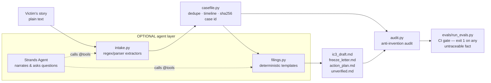

# Recourse

**A first-response agent for fraud victims.** Paste your story — plain language plus whatever
fragments you have (transaction hashes, wallet addresses, amounts, dates, URLs, emails) — and
Recourse turns it into a reviewable evidence record and ready-to-review filing drafts, in minutes,
while acting fast still matters.

Built for the AWS **"Agents for Humans"** hackathon, **Good Neighbor track**, with the
[Strands Agents SDK](https://strandsagents.com). Born out of the maintainer's four years of
volunteer work with cybercrime victims: the hours right after a scam are when a freeze request or
a complete IC3 complaint can still change the outcome — and they are exactly the hours when a
panicked victim can't produce one.

> **Every document Recourse produces is a DRAFT for the victim to review before filing.
> Recourse is not a lawyer and nothing it outputs is legal advice.**

## What it does

From one pasted story, Recourse produces:

1. **`casefile.json`** — a canonical CaseFile: deduped, timeline-ordered evidence with explicit
   verified-vs-`[NOT PROVIDED]` fields and a stable case id (sha256 of normalized contents).
2. **`ic3_draft.md`** — an FBI IC3 complaint draft mapped to the real form's seven steps
   (complaint type, victim info, financial transactions, subjects, description, other info,
   signature), respecting the form's actual mechanics (10-transaction cap, 3,500-character
   description limit, amounts with no `$` or commas, no file uploads).
3. **`freeze_letter.md`** — an exchange fraud-report / freeze-request letter with exact
   transaction details, conservatively worded (a freeze is requested, never promised).
4. **`action_plan.md`** — an ordered plan with urgency rationale and official links:
   exchange fraud team first (funds move fast), then IC3, FTC, local police, plus situational
   channels (SEC, CFTC, elder-fraud hotline) and a recovery-scam warning.
5. **`unverified.md`** — an explicit list of everything that could **not** be verified or was
   not provided. Nothing is ever guessed.

## Quickstart — offline mode (no API key, no network, no model)

```bash
git clone https://github.com/bakulbadwal/recourse && cd recourse
python3 -m venv .venv && source .venv/bin/activate
pip install -e .

# Run the bundled fictional example:
python -m recourse demo --out demo-case/

# Run on your own story:
python -m recourse intake my_story.txt --out my-case/
```

That is the entire product working end to end: five files, deterministic, reproducible —
same story in, same case id and same drafts out, on any machine, any day.

## Quickstart — agent mode (optional, interactive)

```bash
pip install -e ".[agent]"        # pulls in strands-agents[anthropic]

# Anthropic API:
export ANTHROPIC_API_KEY=sk-ant-...   # or use AWS credentials for Bedrock (the Strands default)
python -c "from recourse.agent import main; main()" < my_story.txt
```

The agent wraps the same deterministic functions as Strands `@tool`s
(`build_case_file`, `draft_ic3_complaint`, `draft_freeze_letter`, `draft_action_plan`,
`list_unverified`) and talks the victim through the results. With no `ANTHROPIC_API_KEY`,
Strands defaults to Amazon Bedrock (AWS credentials + Bedrock model access for Claude required).

## Architecture: the model is not allowed to know numbers



**Deterministic Python owns every fact.** Extraction is pure regex/parsing — no model is
involved. Hashes, addresses, amounts, dates, and field mappings are computed and rendered by
code. The (optional) model layer narrates, structures the conversation, and asks the victim for
missing fields; its system prompt forbids stating any hash/amount/date not present in tool
output, and even if it tried, the filings themselves are rendered by templates the model never
touches.

A filing draft with one wrong hash is worse than no draft at all — this boundary is the product.

### The anti-invention eval gate

```bash
pip install -e ".[dev]"
pytest -q                    # 80+ unit tests
python evals/run_evals.py    # the gate; non-zero exit on any failure
```

For seven golden scenarios (multi-chain crypto, romance/pig-butchering scams, a no-crypto wire
fraud, ambiguous date formats, and a negative-control story full of lookalike strings), the gate
checks that:

- every hash/address/amount/date in every rendered filing exists **verbatim in the source story**
  (or is a declared derivation, like the loss total or the sha256 case id);
- extraction matches hand-verified expected values **exactly** — extras fail, misses fail;
- truncated hashes, hex strings with invalid characters, 39-character addresses, and
  contextless 64-hex strings are **not** extracted (negative controls);
- the same input yields the same case id (determinism);
- and, as a self-test, filings deliberately tampered with an invented hash/amount/date/address
  **are flagged** — proving the gate can actually fail.

## Honest limitations

- Extraction is deliberately conservative: unusual phrasings of amounts/dates, and Solana/Tron/
  Monero-style identifiers, may be missed. Missed facts land in `unverified.md` for the victim
  to add by hand; that trade is intentional — a miss is recoverable, a fabrication is not.
- Base58/bech32 matching is heuristic (context-gated, no checksum validation); a syntactically
  valid but mistyped address will pass through exactly as the victim wrote it.
- Ambiguous slash dates (03/04/2026) are read as US month/day/year, flagged for confirmation.
- Recourse verifies nothing externally — no on-chain lookups, no exchange contact. It structures
  what the victim reports; investigators verify.
- US-centric: the filing map targets IC3/FTC. The freeze letter and case file are
  jurisdiction-neutral.
- The IC3 step structure and required fields follow the DOJ/OVC walkthrough and IC3's FAQ;
  quoted labels are exact where those sources quote them, descriptive otherwise.

## Hackathon statements

- **Track:** Good Neighbor — an agent that does real work for real people at one of the worst
  moments of their financial lives, end to end: story in, filed-ready drafts and an ordered plan
  out.
- **AI-assistance disclosure:** built during the submission window with AI coding assistants,
  per hackathon rules; all code net-new for this project.
- **Example data:** every story in `examples/` and `evals/golden/` is synthetic — fictional
  people, invented hashes/addresses, `.example` domains.
- **License:** Apache-2.0 (see `LICENSE`).

## Repository layout

```
src/recourse/
  intake.py     deterministic extractors (regex/parsers only)
  casefile.py   canonical CaseFile: dedupe, timeline, sha256 case id
  filings.py    IC3 draft, freeze letter, action plan, unverified report
  audit.py      anti-invention provenance audit
  tools.py      Strands @tool wrappers (lazy import; base install needs no strands)
  agent.py      build_agent(): Anthropic provider or Bedrock default
  cli.py        offline pipeline: python -m recourse intake|demo
evals/          golden stories + expected extractions + the gate
tests/          unit tests (pytest)
```
